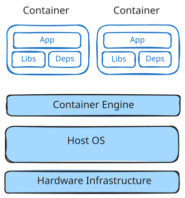

> This post is currently in progress
{: .prompt-info }

**It works on my computer!**
And that's how Docker is born.

Jokes aside, before Docker, if you wanted to share a project under the same conditions, you would have to be on the same OS, download the code, the dependencies, execute the project in a certain way etc.

Nowadays, you can create **containers** that **encapsulate** all of that and can be **run on every machine**, because all of it is "contained" 😉 on it. By running the container you are replicating the same environment, soooo no more: It works on my computer justification is possible!

## 1. Basic Infrastructure - Virutal Machines (VMs) and Containers
To understand Docker, it's really useful to first understand **how it works at hardware level**, and its advantages against using a VM.

### Virtual Machine (VM)
A VM is a software-based emulation of a physical computer allowing it to run a **separate operating system** and applications within a **single host machine**. %20is,02/)

Meaning - you can have on your computer, another full-blown machine with its own operating system and kernel.

**What is the infrastructure that makes this possible?**

The key underlying technology behind virtualization are **hypervisors**, which act as **intermediaries between the physical hardware and the VMs**, allocating resources like CPU, memory and storage.

#### Types of hypervisors
##### Type 1

The de facto standard for enterprise-class virtualization.
This hypervisor has a **direct connection to the hardware**, thus achieving a really good performance with little latency.

##### Type 2

Type 2 hypervisors are installed **on top of an existing host OS**, which introduces latency, and compromises the VMs running on top of the host if any security flaws or vulnerabilities arises.

But, this makes it **simpler and faster to set up** and use for light tasks, becoming really useful for chores such as testing a software product prior to release or learning a new OS.

### Docker Container
Containers offer a new perspective, instead of abstracting the physical hardware, which requires a full copy of an OS, binaries, libraries, etc taking up tens of GBs; containers only virtualize software layers above the operating system level.

This results in lightweight, fast and portable environments, but because all containers on the same machine share the host OS kernel, a vulnerability there can be exploited by a compromised container, potentially leading to a complete system compromise.

Note: dive deeper on some other section maybe on risks and how to prevent them? all containers on the same machine will share the OS kernel, so a vulnerability in the kernel can affect all containers. 
1. (https://sysdig.com/learn-cloud-native/container-security-best-practices/#:~:text=Protect%20your%20resources,layer%20for%20filtering%20network%20requests.)
 2.(https://infosecwriteups.com/unmasking-containers-processes-through-the-hosts-lens-57bbe4e3ed74)
3. https://docs.docker.com/engine/security/

The key point to understand is:
* VMs isolation comes by abstracting the physical hardware - you can see each VM as a separate computer which needs an hypervisor as an intermediary between them and the hardware
* Docker containers isolation comes from the application layer - you can see each container as an isolated process on the host OS, which needs a runtime as an intermediary between them and the OS

 NOTE: add limitations on containers because they share host OS kernel. How to run containers with linux image in windows.

## 2. Key Docker Concepts
### Image
Template or package used to create a container. Includes everything you need to run the container: code, dependencias, libraries and environment variables.

You can create your own images, to include exactly what you need. For the image to be created following your "recipe", you have to specify it formally in a file called Dockerfile, more on that later (link)

### Container
Running instance of an image. Multiple containers can be created from a single image.

As Dockerfiles are used to create the recipe to create an image. The docker-compose file is created for
running multiple containers, specifying how each container its created (underlying image etc) and how the running containers can communicate.

NOTE: dive a bit deeper on container being processes (https://labs.iximiuz.com/tutorials/containers-are-processes-d17b1df8)
https://www.youtube.com/watch?v=7CKCWqUkMJ4
https://securitylabs.datadoghq.com/articles/container-security-fundamentals-part-1/

### Docker Host

## 3. Docker Engine
> With knowledge of Basic Docker infra + key docker concepts + key linux concepts.
> Think where to put it. maybe after linux concepts?

- Daemon, Docker engine RESTful API, Client, Socket communication

## 4. Essential Linux Concepts for Understanding Docker
- Port Mapping (Ports & IPs)
- Volume Mounting (Volumes & Mounts)
- Process Isolation (Namespaces & PIDs)
- Resource Limits (Control Groups)

## 5. Dockerfile - Build Images
- Layered Architecture (COW), Storage Drivers
- CMD vs Entrypoint
-  multi-stage builds

## 6. Docker Compose - Run multiple containers
- dedicated bridge network, communicate with service names (Internal DNS Server)

## 7. Docker Registry
- How registries work
- Internal private registries
- Tags to specify registry
- Push

## 8. Networking
- Default networks
- user defined networks
- network namespaces
- veth pairs

## 9. Container Orchestration - The need of using an orchestrator
- Brief intro to why orchestrator is needed
- Why Docker alone isn't enough

# Resources
- [Hypervisor types](https://www.techtarget.com/searchitoperations/tip/Whats-the-difference-between-Type-1-vs-Type-2-hypervisor#:~:text=A%20Type%201%20hypervisor%20has%20direct%20access,be%20accomplished%20through%20the%20host%20operating%20system.)
